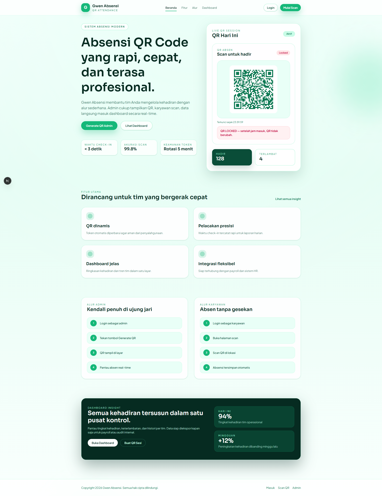

# Gwen Absensi

[](https://github.com/Yudbay1809/qr-absensi/actions/workflows/ci.yml)


Sistem absensi QR Code berbasis Next.js (App Router), dirancang untuk alur admin dan karyawan yang cepat, rapi, dan aman.

## Demo

- Production: https://gwenabsensi.vercel.app
- Preview: https://absensi-qrcode-3n7jvi5dj-yudbay1809s-projects.vercel.app

## Screenshot



## Fitur Utama

- Generate QR sesi absensi (admin)
- Scan QR untuk absensi (karyawan)
- Dashboard ringkas + export CSV/Excel
- Riwayat absensi dengan filter tanggal/status

## Stack

- Next.js (App Router)
- Prisma (ORM)
- SQLite (lokal) / PostgreSQL (produksi)
- Tailwind CSS
- html5-qrcode

## Struktur Proyek

- `app/` UI dan route handler
- `prisma/` schema + seed
- `lib/`
  - `lib/public/` util umum (prisma, rate-limit, shift)
  - `lib/user/` auth & session
  - `lib/admin/` helper admin
- `components/`
  - `components/(shared)/` UI reusable
  - `components/admin/` komponen khusus admin
  - `components/user/` komponen khusus user
  - `components/public/` komponen landing/public

## Setup Lokal

1. Install dependencies:

```bash
npm install
```

2. Siapkan env:

```bash
copy .env.example .env
```

Jika memakai Windows, pastikan `DATABASE_URL` menunjuk ke path absolut, contoh:

```
DATABASE_URL="file:D:/absensi-qrcode/prisma/dev.db"
```

3. Inisialisasi database lokal (SQLite):

```bash
npm run db:init
```

4. Seed data demo:

```bash
npm run seed
```

5. Jalankan server:

```bash
npm run dev
```

## Akun Demo

- Admin: `admin` / `admin123`
- Karyawan: `karyawan` / `karyawan123`

## Catatan

- Default database menggunakan SQLite untuk pengembangan lokal.
- Ubah `DATABASE_URL` di `.env` jika ingin memakai PostgreSQL/MySQL.
- Jika `prisma migrate` mengalami error di mesin Anda, gunakan `npm run db:init` sebagai init SQL lokal.

## Roadmap

- Role & permission granular (multi-tenant / multi-lokasi).
- Jadwal kerja fleksibel per karyawan + kalender libur.
- Validasi lokasi (GPS / geofence) & device binding.
- Export laporan yang bisa dikustomisasi (template payroll).
- Dashboard analitik lanjutan + notifikasi otomatis.

## Changelog

### v1.0.0

- Struktur folder dipisah per domain (landing, auth, admin, user).
- Komponen reusable dan domain-specific dipisah (shared/admin/user/public).
- QR session auto-refresh + mode locked.
- Export CSV/Excel dan dashboard ringkas.
